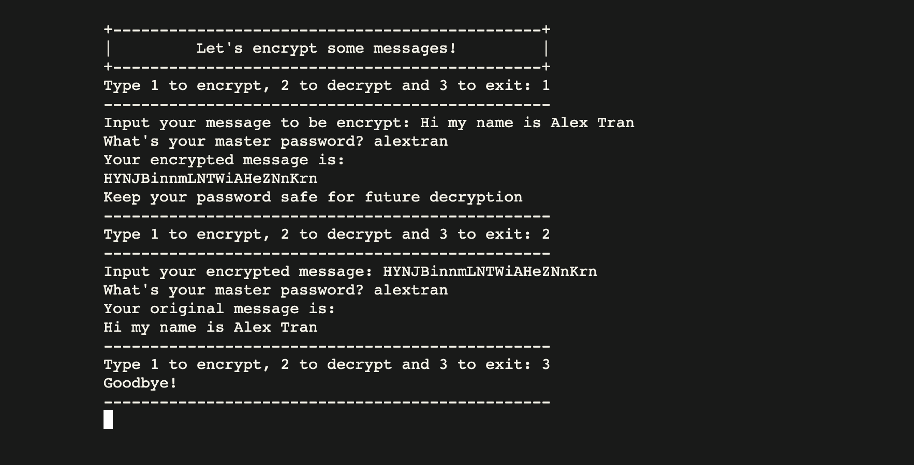

# Python message encryption

- A message encryption/description python program which use a master password to hide any message
- This is the final assignment to Stanford Code in Place 2024 python course
**- Live page [here](https://alextran.pyscriptapps.com/message-encryption/)**

## Functions:

- Encrypt message using a master password
- Decrypt the encrypted message using the original password
- Friendly terminal prompt / interface

## Technologies used

Languages:

- Python

Libraries and frameworks:

- [Pyscript](https://pyscript.com)

## Setup and usage

- Clone the project: ```git clone https://github.com/alextrandev/python_message_encryption```
- Change working directory ```cd python_message_encryption```
- Run script in terminal ```python3 main.py``` 
_make sure to have python version 3 installed before running the script_

## Screenshot
**Homepage**


## Sources 

- [Stanford Code in Place](https://codeinplace.stanford.edu) 
_Thank you Chris, Mehran, our section leader and the whole community for a wonderful python journey_